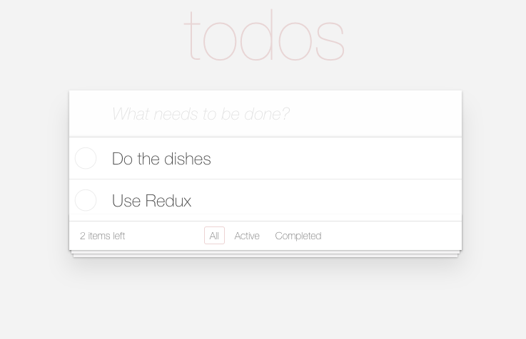
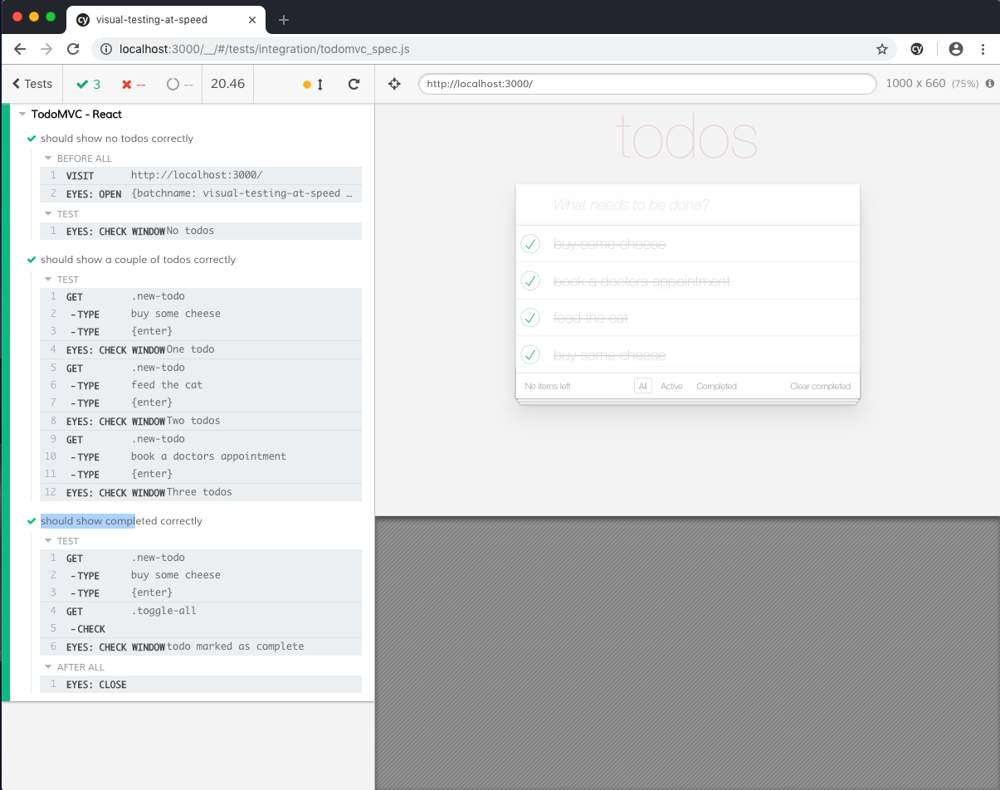
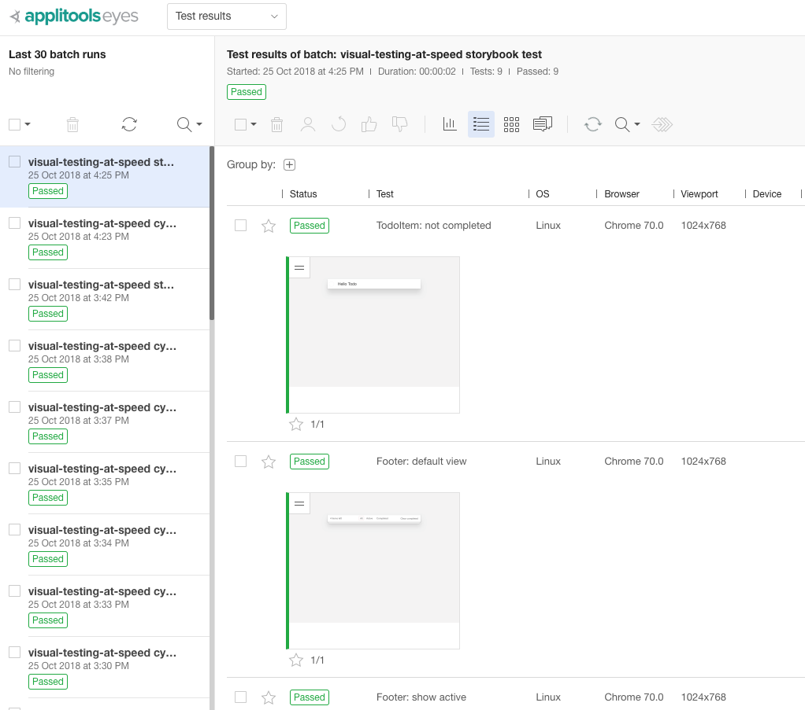

# React TodoMVC, including eyes.cypress and eyes.storybook tests

(forked from [Storybook React Samples](https://github.com/kadira-samples/react-storybook-demo), which was
forked from the [Redux examples directory](https://github.com/reactjs/redux/tree/master/examples/todomvc))

This repo includes an app with support for [React Storybook](https://github.com/kadirahq/react-storybook).

It also includes support for visually testing the TodoMVC app using
Applitools' [Storybook SDK](https://npmjs.com/package/@applitools/eyes.storybook) and [Cypress SDK](https://npmjs.com/package/@applitools/eyes.cypress).

## Installation

Run

```sh
npm ci # (or use "npm install" for older versions of node)
```

## Running the TodoMVC app

Run

```sh
npm start
```

Then open `http://localhost:3000` on your browser.



## Showing the storybook

```sh
npm run storybook
```

Then open `http://localhost:9001` on your browser.


## Visual Testing using Cypress

Set the environment variable APPLITOOLS_API_KEY to your Applitools api key.

```sh
export APPLITOOLS_API_KEY=<your-api-key> # Mac/Linux
# or...
set APPLITOOLS_API_KEY=<your-api-key> # Windows
```

Now run [Cypress](https://cypress.io).

```sh
npm run eyes-cypress
```

Then click on the single test in the Cypress window to run it.



Once the tests passes,
goto [Applitools Eyes Test manager](https://eyes.applitools.com) to see the results.

## Visual Testing using Storybook

Run

```sh
npm run eyes-storybook
```

Then wait for the test to pass, and goto [Applitools Eyes Test manager](https://eyes.applitools.com) to see the results.



## Configuring more browsers to visually test

Edit the file `applitools.config.js` and play around with the `browser` field
to add or remove more browsers/browser widths.
